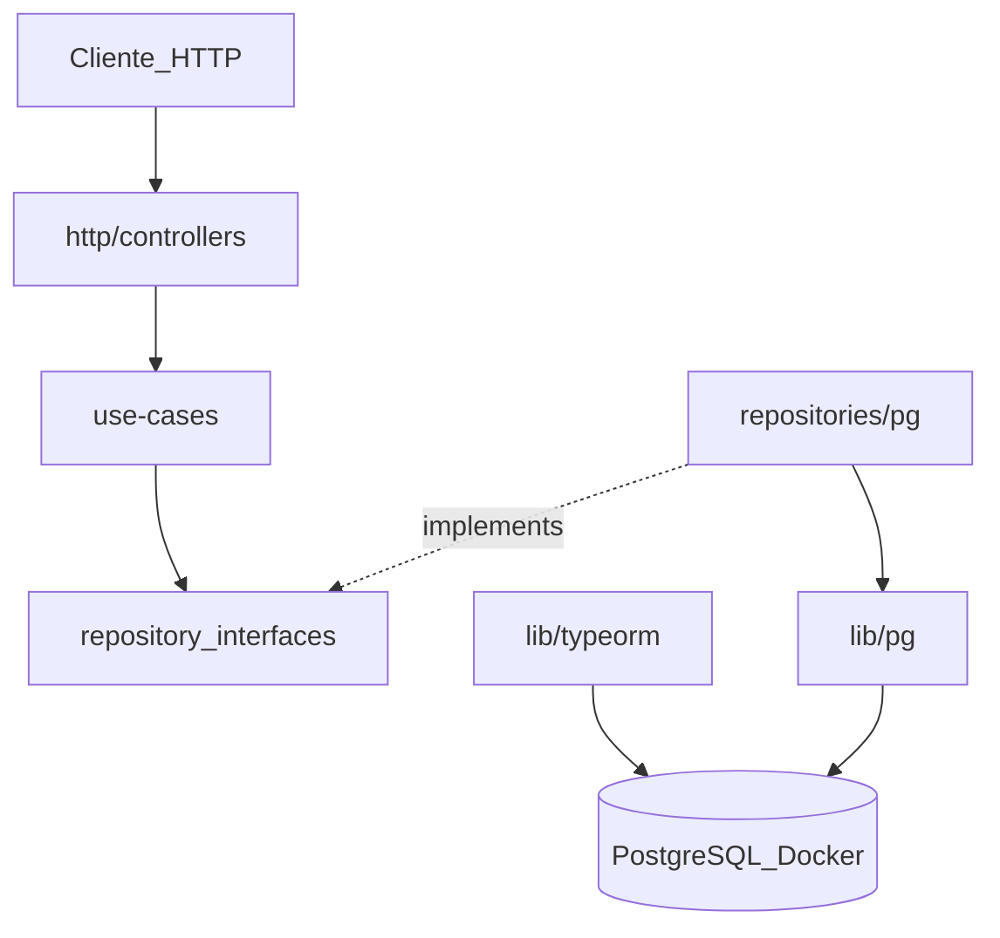

# Pettech

API REST em Node.js e TypeScript para gestão de usuários, pessoas, endereços e catálogo de produtos, com PostgreSQL executado via Docker Compose.

## Visão geral

- **Runtime:** Node.js (ESM)
- **Servidor HTTP:** Fastify
- **Banco de dados:** PostgreSQL (`pg` + TypeORM)
- **ORM:** TypeORM com decorators para novas entidades (`Product`, `Category`)
- **Validação:** Zod (body, params e variáveis de ambiente)
- **Build:** tsup (saída em `build/`)

## Arquitetura

O projeto segue uma arquitetura em camadas, separando responsabilidades entre apresentação, regras de aplicação, acesso a dados e infraestrutura.



### Estrutura em `src/`

| Pasta | Responsabilidade |
|-------|------------------|
| `entities/` | Classes de domínio (`User`, `Person`, `Address`, `Product`, `Category`) |
| `entities/models/` | Contratos TypeScript das entidades (`IUser`, `IPerson`, `IAddress`, `IProduct`, `ICategory`) |
| `env/` | Validação de variáveis de ambiente com Zod |
| `http/controllers/` | Rotas e handlers HTTP (entrada da API) |
| `lib/pg/` | Conexão PostgreSQL via driver `pg` (repositórios legados) |
| `lib/typeorm/` | DataSource TypeORM (`appDataSource`) com `synchronize: true` |
| `utils/` | Utilitários compartilhados (ex.: tratamento global de erros) |
| `repositories/` | Contratos de acesso a dados (`*.repository.interface.ts`) |
| `repositories/pg/` | Implementações PostgreSQL dos repositórios (driver `pg`) |
| `repositories/typeorm/` | Implementações TypeORM (`ProductRepository`, `CategoryRepository`) |
| `use-cases/` | Regras de aplicação e orquestração |
| `use-cases/factory/` | Factories que instanciam use cases com suas dependências |
| `use-cases/errors/` | Erros de domínio reutilizados na aplicação |

### Bootstrap

- `src/app.ts` — carrega `reflect-metadata`, inicializa o TypeORM, registra as rotas e conecta o `globalErrorHandler`
- `src/server.ts` — sobe o servidor na porta definida em `PORT`
- `src/utils/global-error-handler.ts` — mapeia erros de domínio e validação para respostas HTTP

### Modelos de domínio

As classes em `entities/` implementam contratos em `entities/models/`, desacoplando repositórios e use cases das implementações concretas:

| Interface | Classe | Campos principais |
|-----------|--------|-------------------|
| `IUser` | `User` | `username`, `password` |
| `IPerson` | `Person` | `cpf`, `name`, `birth`, `email`, `user_id` |
| `IAddress` | `Address` | `street`, `number` (integer), `complement`, `neighborhood`, `city`, `state`, `zip_code`, `person_id` |
| `IProduct` | `Product` (TypeORM) | `name`, `description`, `image_url`, `price`, `categories[]` — `id` UUID |
| `ICategory` | `Category` (TypeORM) | `name`, `created_at` |

`Product` e `Category` possuem relação **ManyToMany** via tabela `product_category`. Ao criar um produto, categorias podem ser enviadas no body e são persistidas com `cascade: true`.

As implementações PostgreSQL em `repositories/pg/` tipam parâmetros e retornos com as interfaces de `User`, `Person` e `Address`. `Product` e `Category` usam TypeORM em `repositories/typeorm/` e são sincronizados automaticamente pelo `appDataSource`.

### TypeORM

Configuração em `src/lib/typeorm/typeorm.ts`:

- Conexão PostgreSQL reutilizando variáveis de ambiente (`POSTGRES_*`)
- Entidades registradas: `Product`, `Category`
- Migration `ProductAutoGenerateUUID` — define `uuid_generate_v4()` como default do `product.id`
- `synchronize: true` — cria/atualiza tabelas automaticamente em desenvolvimento
- `logging` habilitado quando `NODE_ENV === 'development'`

> **Atenção:** `synchronize: true` é adequado para desenvolvimento. Em produção, prefira migrations explícitas.

### Repositórios e inversão de dependência

Os use cases dependem de **interfaces de repositório**, não das implementações concretas. As factories instanciam as classes em `repositories/pg/` e as injetam via contrato:

| Interface | Implementação PG | Métodos |
|-----------|------------------|---------|
| `IPersonRepository` | `PersonRepository` | `create` |
| `IUserRepository` | `UserRepository` | `create`, `findWithPerson` |
| `IAddressRepository` | `AddressRepository` | `create`, `findAddressesByPersonId` |
| `IProductRepository` | `ProductRepository` (TypeORM) | `create` |
| `ICategoryRepository` | `CategoryRepository` (TypeORM) | `create` |

### Use cases de categoria

| Use case | Descrição |
|----------|-----------|
| `CreateCategoryUseCase` | Cria categoria via TypeORM |

Controllers em `http/controllers/category/` expõem o endpoint abaixo.

### Use cases de produto

| Use case | Descrição |
|----------|-----------|
| `CreateProductUseCase` | Cria produto com categorias opcionais via TypeORM |

Controllers em `http/controllers/product/` expõem o endpoint abaixo.

### Use cases de endereço

| Use case | Descrição |
|----------|-----------|
| `CreateAddressUseCase` | Cria endereço vinculado a uma pessoa (`person_id`) |
| `FindAddressByPersonUseCase` | Lista endereços de uma pessoa com paginação (`page`, `limit`) |

Controllers em `http/controllers/address/` expõem os endpoints abaixo.

### Factories de use cases

Os controllers não instanciam repositórios diretamente. A composição fica centralizada em `use-cases/factory/`:

| Factory | Use case |
|---------|----------|
| `makeCreateUserUseCase()` | `CreateUserUseCase` |
| `makeCreatePersonUseCase()` | `CreatePersonUseCase` |
| `makeFindWithPersonUseCase()` | `FindWithPersonUseCase` |
| `makeCreateAddressUseCase()` | `CreateAddressUseCase` |
| `makeFindAddressByPersonUseCase()` | `FindAddressByPersonUseCase` |
| `makeCreateProductUseCase()` | `CreateProductUseCase` |
| `makeCreateCategoryUseCase()` | `CreateCategoryUseCase` |

### Tratamento de erros

A função `globalErrorHandler` em `src/utils/global-error-handler.ts` centraliza as respostas HTTP e é registrada em `app.ts` via `app.setErrorHandler`:

| Erro | Status | Resposta |
|------|--------|----------|
| `ZodError` (validação de body/params) | `400` | `{ message: "Validation error", errors: ... }` |
| `ResourceNotFoundError` | `404` | `{ message: "Resource not found" }` |
| Demais erros | `500` | `{ message: "Internal server error" }` |

O use case `FindWithPersonUseCase` lança `ResourceNotFoundError` quando o usuário não existe, em vez de retornar `undefined` para o controller tratar manualmente.

## Endpoints da API

| Método | Rota | Descrição | Body / Params |
|--------|------|-----------|---------------|
| `POST` | `/user` | Cria usuário | `{ "username": "string", "password": "string" }` |
| `GET` | `/user/:id` | Busca usuário com dados de person (JOIN) | `id` na URL — retorna `404` se não encontrado |
| `POST` | `/person` | Cria pessoa vinculada a um usuário | `{ "cpf": "string", "name": "string", "birth": "YYYY-MM-DD", "email": "string", "user_id": number }` |
| `POST` | `/address` | Cria endereço vinculado a uma pessoa | `{ "street": "string", "number": number, "complement": "string", "neighborhood": "string", "city": "string", "state": "string", "zip_code": "string", "person_id": number }` |
| `GET` | `/address/person/:person_id` | Lista endereços de uma pessoa (paginado) | `person_id` na URL; query `page` e `limit` (padrão: 1 e 10) |
| `POST` | `/product` | Cria produto com categorias opcionais | `{ "name": "string", "description": "string", "image_url": "string", "price": number, "categories": [{ "name": "string", "id"?: number }] }` |
| `POST` | `/category` | Cria categoria | `{ "name": "string" }` |

### Exemplo — criar usuário

```bash
curl -X POST http://localhost:3000/user \
  -H "Content-Type: application/json" \
  -d '{"username": "celso", "password": "123456"}'
```

### Exemplo — criar pessoa

```bash
curl -X POST http://localhost:3000/person \
  -H "Content-Type: application/json" \
  -d '{
    "cpf": "11111111111",
    "name": "Celso Gonçalves",
    "birth": "1900-01-01",
    "email": "teste@teste.com",
    "user_id": 1
  }'
```

> **Observação:** o campo `cpf` no banco aceita até 11 caracteres (`varchar(11)`). Envie o CPF sem máscara (apenas dígitos).

### Exemplo — criar endereço

```bash
curl -X POST http://localhost:3000/address \
  -H "Content-Type: application/json" \
  -d '{
    "street": "Rua das Flores",
    "number": 123,
    "complement": "Apto 45",
    "neighborhood": "Centro",
    "city": "São Paulo",
    "state": "SP",
    "zip_code": "01001000",
    "person_id": 1
  }'
```

### Exemplo — listar endereços por pessoa

```bash
curl "http://localhost:3000/address/person/1?page=1&limit=10"
```

### Exemplo — criar produto

```bash
curl -X POST http://localhost:3000/product \
  -H "Content-Type: application/json" \
  -d '{
    "name": "Ração Premium",
    "description": "Ração para cães adultos 15kg",
    "image_url": "https://example.com/racao.png",
    "price": 89.90,
    "categories": [
      { "name": "Alimentação" },
      { "name": "Cães" }
    ]
  }'
```

### Exemplo — criar categoria

```bash
curl -X POST http://localhost:3000/category \
  -H "Content-Type: application/json" \
  -d '{ "name": "Alimentação" }'
```

## Pré-requisitos

- Node.js 22+
- npm
- Docker e Docker Compose

## Configuração e execução

### 1. Variáveis de ambiente

Copie `.env.example` para `.env` e preencha:

```env
PORT=3000
POSTGRES_USER=root
POSTGRES_PASSWORD=pettech
POSTGRES_DB=pettech
POSTGRES_HOST=localhost
POSTGRES_PORT=5432
```

### 2. Banco de dados (Docker)

```bash
docker compose up -d
```

O `docker-compose.yml` sobe um container PostgreSQL (`pettech-postgres`) na porta `5432`, com volume persistente e script de inicialização em `docker/postgres/`.

**Migração da tabela `address` (bancos já existentes):**

Se o container já foi criado antes das colunas `number`, `complement` e `neighborhood`, execute manualmente:

```bash
docker exec -i pettech-postgres psql -U root -d pettech < docker/postgres/002-add-address-columns.sql
```

O script `docker/postgres/002-add-address-columns.sql` adiciona as colunas ausentes na tabela `address`.

### 3. Instalar dependências

```bash
npm install
```

### 4. Desenvolvimento

```bash
npm run start:dev
```

O servidor ficará disponível em `http://localhost:3000`.

### 5. Build e produção local

```bash
npm run build
npm run start
```

O comando `build` compila o código TypeScript para a pasta `build/` (ignorada pelo Git).

## Scripts npm

| Script | Comando | Uso |
|--------|---------|-----|
| `start:dev` | `tsx watch src/server.ts` | Desenvolvimento com hot reload |
| `start` | `tsx src/server.js` | Execução após build |
| `build` | `tsup src --out-dir build` | Compila TypeScript para `build/` |

## Dependências

### Produção

| Pacote | Uso |
|--------|-----|
| `fastify` | Servidor HTTP |
| `pg` | Driver PostgreSQL |
| `typeorm` | ORM para entidades `Product` e `Category` |
| `reflect-metadata` | Suporte a decorators TypeORM (requerido no bootstrap) |
| `zod` | Validação de schemas e variáveis de ambiente |
| `dotenv` | Carregamento do arquivo `.env` |

### Desenvolvimento

| Pacote | Uso |
|--------|-----|
| `typescript` | Compilador TypeScript |
| `tsx` | Execução de TS em desenvolvimento |
| `tsup` | Bundler/build para `build/` |
| `@types/node`, `@types/pg` | Tipagens |
| `eslint`, `prettier` e plugins | Lint e formatação de código |

## Estrutura do repositório

```
pettech/
├── build/              # saída do tsup (gitignored)
├── docker/
│   └── postgres/       # scripts de init e migrações SQL
├── src/
│   ├── entities/
│   │   └── models/
│   ├── env/
│   ├── http/controllers/
│   │   ├── address/
│   │   ├── category/
│   │   ├── person/
│   │   ├── product/
│   │   └── user/
│   ├── lib/
│   │   ├── pg/
│   │   └── typeorm/
│   │       └── migrations/
│   ├── repositories/
│   │   ├── *.repository.interface.ts
│   │   ├── pg/
│   │   └── typeorm/
│   ├── utils/
│   └── use-cases/
│       ├── errors/
│       └── factory/
├── docker-compose.yml
├── .env.example
└── package.json
```

## Postman

Coleção de requisições disponível em `.postman/Pettech.postman_collection.json`.

## Arquivos ignorados pelo Git

- `.env` — credenciais e configurações locais
- `build/` — artefatos de compilação
- `node_modules/` — dependências instaladas

## Considerações

Código desenvolvido por Celso Gonçalves e com o apoio do Cursor Agent para a criação do README e commits.